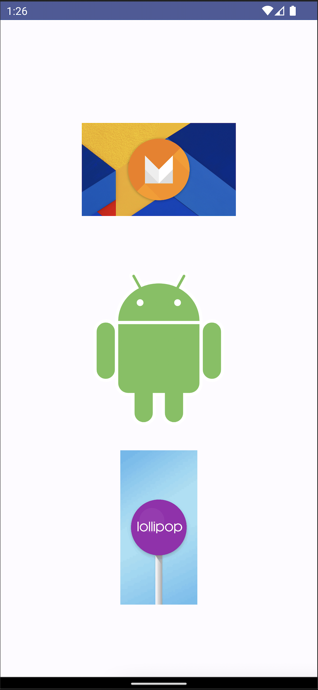

<h1 align="center">Coil Compose</h1> 

<p align="center">
This app was created to learn more about Android compose using Coil to load images in .png .jpg .svg format and .gif.
</p>

## Installation

Clone this repository and import into **Android Studio**

```bash
git clone https://github.com/munbonecci/CoilSvg.git
```

## Build variants

Use the Android Studio *Build Variants* button to choose between **debug** and **release**
flavors

## Maintainers

This project is maintained by:

* [Edmundo Bonequi](http://github.com/munbonecci)

## Built with

- [Kotlin](https://kotlinlang.org/) - For coding.
- [Coil Compose](https://coil-kt.github.io/coil/compose/) -For load images in different formats.
- Jetpack
    - [Compose](https://developer.android.com/jetpack/compose?gclid=CjwKCAiAzKqdBhAnEiwAePEjkkbfP8b_r6c57F3jtdwOjxWpBbNOXVmpSnAUu4HKCid7KtSvfiiYeRoC1wYQAvD_BwE&gclsrc=aw.ds)
        - Android’s recommended modern toolkit for building native UI.

## How I run the app?

- Clone the repository
- Open it in Android Studio
- Wait until dependencies are installed
- Run app in your emulator or physical device

